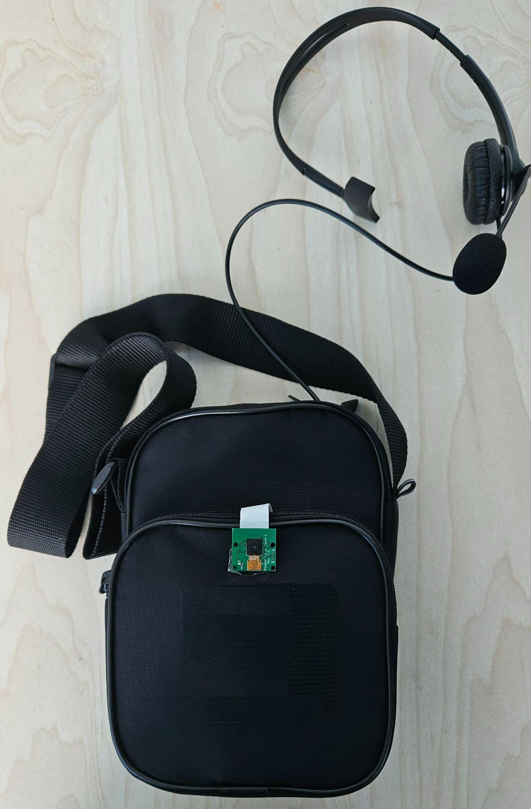

# SpatialVisualAid: AI-Powered Spatial Navigation Assistant for the Visually Impaired

**Team:** NightfoodRetrieval

**Competition:** Vietnam Electronic Design Competition (VEDC) 2025

## Overview

This project presents a wearable AIoT device designed to redefine spatial navigation for the visually impaired. Unlike traditional solutions that rely on basic 2D object detection or simple proximity sensors, this system provides comprehensive **3D spatial awareness**.

By leveraging a hybrid edge-cloud architecture, the device captures environmental data and translates it into natural language instructions. It goes beyond identifying *what* an object is, providing critical context regarding *where* it is located in absolute metric space (distance, orientation, and size), acting as a proactive virtual assistant.

## System Architecture

The solution utilizes a distributed microservices architecture designed to balance low latency with high-performance computing.

### 1. The Edge (Client)
The wearable device functions as a "Thin Client," responsible for sensory data acquisition and user interaction. To ensure responsiveness, the client operates via a multi-threaded architecture that handles:
*   **Audio Input:** Capturing voice commands via a mono headset.
*   **Wake Word Detection:** A local, lightweight inference engine continuously listens for the activation phrase ("Xin chào") to trigger the system, utilizing fuzzy matching logic to filter background noise.
*   **Image Acquisition:** Capturing high-resolution RGB data upon command.
*   **Audio Output:** Receiving and playing streamed audio chunks for instant feedback.

### 2. The Cloud (Processing Backend)
The heavy computational workload is offloaded to a GPU-accelerated server. The backend processes data through a multi-stage pipeline:
*   **Real-Time ASR (Automatic Speech Recognition):** Voice data is streamed to an NVIDIA NIM container running the **Parakeet-CTC** model, optimized for the Vietnamese language.
*   **Intent Classification:** A semantic router determines if the user is requesting a new visual scan or querying information from the current context memory.
*   **Visual-Language Processing:** A quantized **Qwen3-VL** model is served via **vLLM**, allowing the system to answer complex natural language questions about the scene with high throughput.
*   **3D Reconstruction Pipeline:** The system performs monocular depth estimation and point cloud reconstruction (using architectures like **UniK3D** and **YOLOE**) to convert 2D images into 3D metric data.

### 3. Real-Time Text-to-Speech (TTS)
To minimize the "Time to First Byte" (TTFB) latency, the system employs a streaming TTS architecture using **Piper**. The server generates raw PCM audio chunks and streams them via WebSockets immediately as text is generated, allowing the user to hear the response while the sentence is still being completed.

## Hardware Design

The hardware is designed for portability and ease of use, adopting a "chest-pack" form factor similar to wearing a medal. This positioning ensures the camera has a stable, forward-facing field of view consistent with the user's torso orientation.

**Components:**
*   **Compute Module:** Raspberry Pi 4 Model B (handling I/O and network streaming).
*   **Vision Sensor:** Raspberry Pi Camera Module V1.3, mounted centrally on the chest unit.
*   **Audio Interface:** A mono, call-center style headset with a boom microphone to isolate user voice commands from street noise.
*   **Power Supply:** High-capacity portable battery bank ensuring extended runtime.

## Technical Implementation Highlights

### Monocular 3D Perception
A core innovation of this project is the ability to derive 3D spatial data from a standard RGB camera without expensive LiDAR sensors. The system utilizes semantic segmentation combined with depth estimation models to lift 2D objects into 3D space. This allows the system to calculate:
*   **Absolute Distance:** How many meters away an object is.
*   **Volumetric Analysis:** Roughly how large an object is.
*   **Spatial Relationships:** Identifying gaps between objects for safe passage.

### Low-Latency Inference
To achieve real-time performance on complex models, the backend leverages **vLLM** for serving the Visual Language Model. This implementation utilizes AWQ quantization and advanced memory management (PagedAttention) to maximize token generation speed, ensuring the conversation feels natural and fluid.

## User Interaction

The device operates entirely hands-free through voice commands, categorized into two primary interaction modes:

### 1. Visual Query
*   **Trigger:** The user asks about the immediate environment (e.g., *"What is in front of me?"*).
*   **Action:** The system wakes up, captures a fresh image, processes the 3D scene, and provides a descriptive summary.

### 2. Context Query
*   **Trigger:** The user asks a specific follow-up question (e.g., *"Where is the chair?"* or *"How far is it?"*).
*   **Action:** The system accesses the context memory of the last captured scene. It performs spatial reasoning on the existing scene graph to provide specific metric details without needing to capture a new image.

## Installation & Setup

*(To be updated)*

## Future Roadmap

*   **Edge Optimization:** Quantization of 3D reconstruction models to run locally on the Raspberry Pi.
*   **IMU Integration:** Adding accelerometers to compensate for body movement during image capture.
*   **Haptic Feedback:** Integrating vibration motors for silent obstacle proximity warnings.

## Team

**University of Information Technology (UIT) - VNU-HCM**
*   **Võ Đăng Khoa** - Computer Engineering
*   **Hồ Minh Quân** - Computer Science
*   **Trần Văn Hoàng** - Computer Science
*   **Advisor:** MSc. Thân Thế Tùng